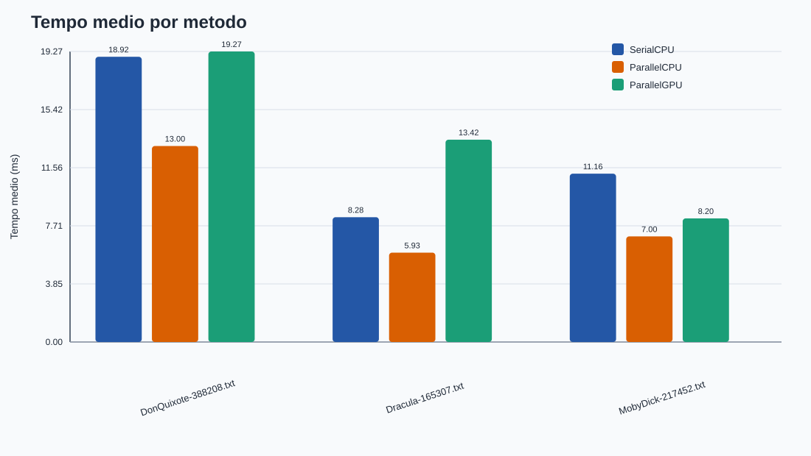
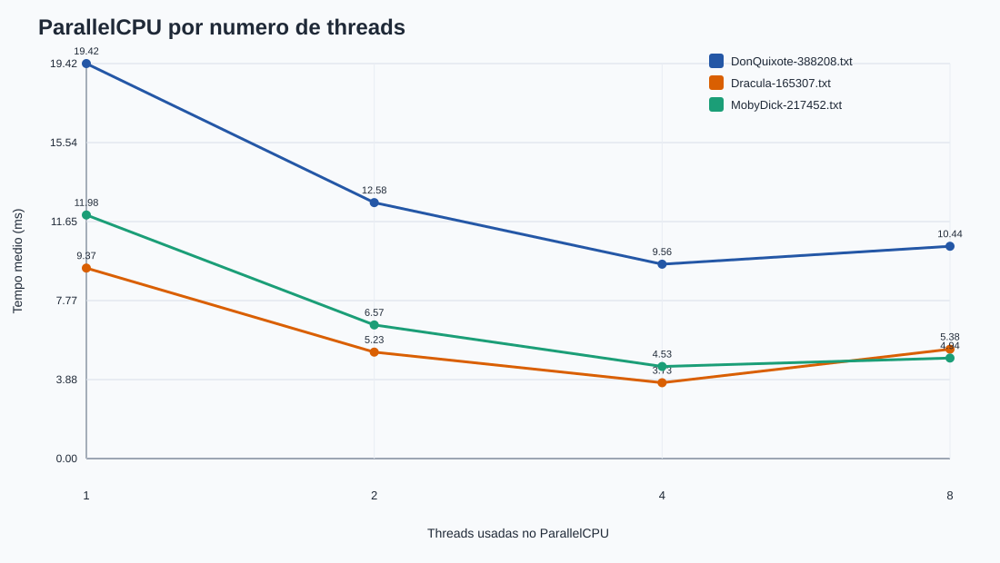

# Analise comparativa de algoritmos com uso de paralelismo

> Link do GitHub: https://github.com/devrodofc/Trabalho-Paralela-Concorrente-av3.git

## Resumo

Este projeto compara tres abordagens para contagem de uma palavra em arquivos de texto utilizando Java:

* `SerialCPU`: percorre o texto utilizando uma unica thread.
* `ParallelCPU`: divide o texto em blocos e utiliza multiplas threads por meio de `ExecutorService`.
* `ParallelGPU`: utiliza OpenCL por meio da biblioteca JOCL para executar a busca de forma massivamente paralela na GPU.

O objetivo e analisar o comportamento de cada abordagem em relacao ao tempo de execucao, corretude dos resultados e ganhos obtidos com paralelismo em CPU e GPU.

O programa executa cada metodo varias vezes para reduzir variacoes de medicao, registra os resultados em arquivos CSV e gera graficos SVG para apoiar a analise comparativa.

---

## Estrutura do Projeto

```text
.
├── lib/
│   └── jocl-2.0.4.jar
├── results/
│   ├── resultados.csv
│   └── graficos/
├── scripts/
│   └── run.sh
├── src/
│   └── Main.java
├── README.md
└── README.pdf
```

---

## Introducao

A contagem de palavras foi escolhida por ser uma operacao simples, repetitiva e facilmente validada entre diferentes modelos de execucao.

A atividade permite observar:

* O impacto da concorrencia em CPU.
* Os custos associados ao gerenciamento de threads.
* O comportamento de uma implementacao baseada em GPU utilizando OpenCL.
* Situacoes em que o paralelismo realmente traz beneficios.

A implementacao considera uma ocorrencia apenas quando a palavra aparece como palavra inteira, ignorando diferencas entre letras maiusculas e minusculas.

Caracteres alfabeticos (`a-z`) e numericos (`0-9`) sao tratados como parte da palavra. Espacos, pontuacao e quebras de linha sao tratados como delimitadores.

---

## Metodologia

Foram utilizadas tres amostras de texto:

* `DonQuixote-388208.txt`
* `Dracula-165307.txt`
* `MobyDick-217452.txt`

Os arquivos sao carregados integralmente em memoria e convertidos para letras minusculas antes do processamento.

O tempo medido considera apenas a etapa de busca e contagem de ocorrencias, excluindo leitura do arquivo e escrita de resultados.

Para minimizar o impacto da compilacao JIT da JVM, o programa executa uma rodada de aquecimento antes das medicoes oficiais.

Cada experimento realiza:

* 3 repeticoes por arquivo.
* 1 execucao SerialCPU.
* Execucoes ParallelCPU com diferentes quantidades de threads.
* 1 execucao ParallelGPU quando houver dispositivo OpenCL disponivel.
* Exportacao dos resultados para CSV.
* Geracao automatica de graficos SVG.

A analise estatistica principal utiliza a media dos tempos de execucao.

---

## Implementacoes

### SerialCPU

A implementacao serial percorre todo o vetor de bytes do texto utilizando apenas uma thread.

Caracteristicas:

* Sem concorrencia.
* Menor sobrecarga.
* Serve como referencia para comparacao.

Metodo principal:

```java
serialCPU(byte[] text, byte[] word)
```

### ParallelCPU

A implementacao paralela em CPU divide o texto em blocos independentes.

Cada bloco e processado por uma thread diferente utilizando `ExecutorService`.

Caracteristicas:

* Paralelismo real em CPU.
* Divisao automatica da carga de trabalho.
* Uso de `Callable` e `Future`.
* Sem compartilhamento de estado mutavel entre threads.

Metodo principal:

```java
parallelCPU(byte[] text, byte[] word, int threads)
```

### ParallelGPU

A implementacao GPU utiliza OpenCL por meio da biblioteca JOCL.

Cada posicao do texto e analisada por um work-item independente executado na GPU.

Caracteristicas:

* Uso real de OpenCL.
* Execucao em hardware grafico.
* Kernel OpenCL implementado no projeto.
* Contagem paralela das ocorrencias.

Metodo principal:

```java
parallelGPU(OpenClCounter counter, byte[] text, byte[] word)
```

---

## Como Executar

### Requisitos

* Java 21 ou superior.
* JOCL 2.0.4.
* Driver OpenCL instalado para execucao em GPU.

### Execucao padrao

```bash
./scripts/run.sh
```

### Informando outro diretorio de amostras

```bash
./scripts/run.sh --samples /caminho/para/Amostras
```

### Alterando palavra pesquisada

```bash
./scripts/run.sh --word whale --runs 3 --threads 1,2,4,8
```

### Executando apenas um arquivo

```bash
./scripts/run.sh --input ~/Downloads/Amostras/Dracula-165307.txt --word blood --threads 4
```

### Executando sem GPU

```bash
./scripts/run.sh --no-gpu
```

### Compilacao manual

```bash
mkdir -p out

javac -encoding UTF-8 \
-cp lib/jocl-2.0.4.jar \
-d out \
src/Main.java

java -cp out:lib/jocl-2.0.4.jar Main
```

---

## Resultados e Discussao

Os resultados sao armazenados em:

```text
results/resultados.csv
```

Campos registrados:

* sample
* file_size_bytes
* word
* method
* workers
* run
* occurrences
* time_ms
* device
* status

Graficos gerados:





### Validacao dos Resultados

Em todas as execucoes realizadas, os tres metodos produziram exatamente a mesma quantidade de ocorrencias.

Exemplos observados:

| Arquivo    | Ocorrencias |
| ---------- | ----------: |
| DonQuixote |         188 |
| Dracula    |        8104 |
| MobyDick   |       14727 |

A igualdade entre os resultados de SerialCPU, ParallelCPU e ParallelGPU confirma a corretude das implementacoes.

### Ambiente de Testes

A execucao final foi realizada em um ambiente com suporte OpenCL ativo.

Dispositivo identificado:

```text
GPU - AMD Accelerated Parallel Processing / gfx1036
```

Todas as execucoes GPU foram realizadas com sucesso e registradas no CSV.

### Analise de Desempenho

Os resultados mostraram que:

* O uso de multiplas threads reduziu significativamente o tempo de execucao em relacao ao metodo serial.
* A melhor configuracao observada foi geralmente entre 4 e 8 threads.
* A implementacao GPU executou corretamente, mas nao apresentou ganhos para os tamanhos de entrada utilizados.

Esse comportamento e esperado porque a execucao em GPU envolve custos adicionais de:

* Criacao de buffers.
* Transferencia de memoria CPU ↔ GPU.
* Inicializacao do kernel OpenCL.

Para arquivos relativamente pequenos, esses custos podem superar os beneficios do paralelismo massivo.

### Exemplo de Speedup

Utilizando os resultados do arquivo Dracula:

| Metodo                  | Tempo Medio |
| ----------------------- | ----------: |
| SerialCPU               |      8,3 ms |
| ParallelCPU (4 threads) |      3,7 ms |

Speedup aproximado:

```text
8,3 / 3,7 ≈ 2,24x
```

Ou seja, a versao paralela foi aproximadamente 2,24 vezes mais rapida que a versao serial nesse cenario.

---

## Conclusao

Os resultados demonstram que o paralelismo pode reduzir significativamente o tempo de execucao quando aplicado corretamente.

A versao SerialCPU apresentou implementacao simples e consistente.

A versao ParallelCPU obteve os melhores resultados para os arquivos analisados, apresentando speedup relevante sem custos excessivos de comunicacao.

A versao ParallelGPU executou corretamente utilizando OpenCL e produziu resultados identicos aos demais metodos. Entretanto, para os volumes de dados utilizados, os custos de transferencia e inicializacao superaram os ganhos potenciais da GPU.

Conclui-se que a escolha da estrategia depende do volume de dados e das caracteristicas do hardware disponivel.

---

## Referencias

* Oracle. Java Platform Documentation.
* Oracle. ExecutorService API Documentation.
* Oracle. Future API Documentation.
* Khronos Group. OpenCL Specification.
* JOCL Project Documentation.
* Project Gutenberg. Digital Library.

---

## Anexos

### Codigo Principal

Arquivo:

```text
src/Main.java
```

Contem:

* SerialCPU
* ParallelCPU
* ParallelGPU
* OpenClCounter
* Exportacao CSV
* Geracao de graficos SVG

### Biblioteca Externa

Biblioteca utilizada:

```text
lib/jocl-2.0.4.jar
```

Pode ser localizada em:

* `lib/jocl-2.0.4.jar`
* `~/Downloads/jocl-2.0.4.jar`

Ou informada manualmente:

```bash
JOCL_JAR=/caminho/para/jocl-2.0.4.jar ./scripts/run.sh
```
